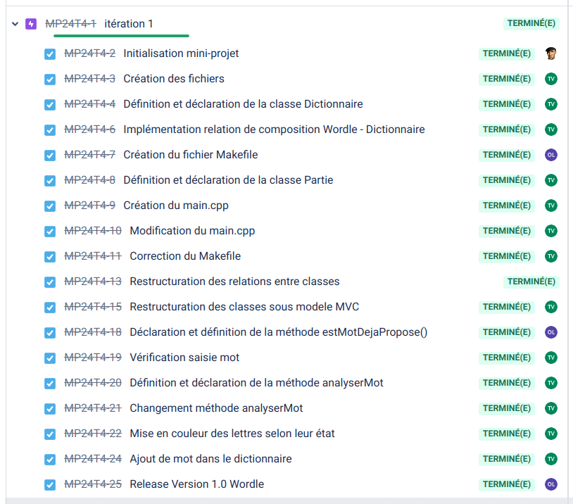
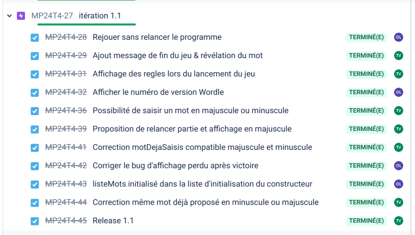
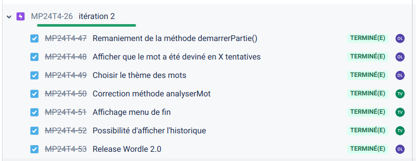
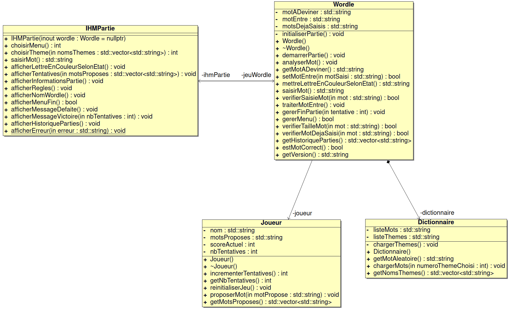

[](https://github.com/btssn-lasalle-84/MP24-T4-WORDLE/actions/workflows/c-cpp.yml)[](https://github.com/btssn-lasalle-84/MP24-T4-WORDLE/actions/workflows/cppformat.yml)


# Mini-Projet WORDLE

- [Mini-Projet WORDLE](#mini-projet-wordle)
  - [Informations](#informations)
  - [Présentation](#présentation)
  - [Utilisation](#utilisation)
  - [Changelog](#changelog)
  - [TODO](#todo)
    - [Version 3.0](#version-30)
  - [Défauts constatés non corrigés](#défauts-constatés-non-corrigés)
  - [Itérations](#itérations)
    - [Itération 1](#itération-1)
    - [Itération 1.1](#itération-11)
    - [Itération 2.0](#itération-20)
  - [Diagramme de classes](#diagramme-de-classes)
  - [Équipe de développement](#équipe-de-développement)


## Informations

- Nom du logiciel : Wordle
- Date de début : 29 novembre 2023 12h28
- Numéro de version du logiciel : 2.1
- Date de cette version du logiciel : Janvier 2024

## Présentation

Le but du jeu est de deviner un mot spécifique de cinq lettres en un maximum de six tentatives, en tapant des lettres sur un écran de six lignes de cinq cases chacune. Chaque lettre devinée à sa bonne place apparaît en vert, une bonne lettre mal placée en jaune.

La personne qui joue inscrit sur la première ligne un mot de cinq lettres de son choix et entre sa proposition. Après chaque proposition, les lettres apparaissent en couleurs :

- VERT : la lettre est dans le mot et au bon endroit
- JAUNE : la lettre est dans le mot mais au mauvais endroit
- ROUGE (facultatif) : la lettre n’est dans le mot à aucun endroit

Le mot doit contenir le bon nombre de lettres et être valable, sinon il est refusé.

Lien Wikipédia : [Wordle](https://fr.wikipedia.org/wiki/Wordle)


## Utilisation

Exemple :

```bash
$ make
g++ -g -c   Dictionnaire.cpp
g++ -g -c   Joueur.cpp
g++ -g -c   main.cpp
g++ -g -c   IHMPartie.cpp
g++ -g -c   Wordle.cpp
g++ -o wordle.out Dictionnaire.o Joueur.o main.o IHMPartie.o Wordle.o

$ ./wordle.out
```

> Il est possible d'ajouter des thèmes de mots dans le dossier `themes/`. Les fichiers au format TXT doivent avoir l'extension `.dic`. Le fichier `Divers.dic` contient 1611 mots de 5 lettres.

```bash
ls -l themes/
total 20
-rw-rw-r-- 1 tv tv   78 janv. 23 09:31 Aliments.dic
-rw-rw-r-- 1 tv tv   78 janv. 23 09:31 Animaux.dic
-rw-rw-r-- 1 tv tv 9666 janv. 23 10:19 Divers.dic
```

## Changelog

Le logiciel dans la version 2.1 propose au joueur de trouver un mot de 5 lettres en 6 tentatives. Si le mot ne contient pas exactement 5 lettres, il n'est pas accepté et le joueur doit resaisir un mot de la bonne taille. Il n'est possible de proposer deux fois le même mot.

Il est possible de choisir un thème de mots.

A chaque fin de partie, il est possible de relancer une partie, d'afficher l'historique de la dernière partie ou de quitter le jeu.

Lorsque le joueur a deviné le mot, le jeu affiche "Félicitations ! Vous avez deviné le mot."

## TODO

### Version 3.0

- Vérifier les mots saisis
- Gérer les accents
- Afficher un état (saisis - non saisis) de l'ensemble des lettres à chaque tour
- Demander à dévoiler le mot en cas d'échec à la fin des 6 tentatives
- Créer une variante : imposer que toutes les lettres révélées doivent être utilisées dans les propositions ultérieures
- saisir le nom du joueur
- sauvegarder et afficher les statistiques du joueur
- chronométrer la partie

## Défauts constatés non corrigés

Ces critères de mots valables ne sont pas vérifiés dans cette version :

- Les mots qui n’existent pas dans les dictionnaires de référence (Larousse et Robert) de l’année en cours et les noms propres.
- Les mots composés (chewing-gum, week-end...).

Les accents ne sont pas gérés dans cette version.

## Itérations

### Itération 1



### Itération 1.1



### Itération 2.0



## Diagramme de classes



## Équipe de développement

- Thomas Vignal thomasvignal.btssn@gmail.com
- Othman Latyaoui othmanlatyaoui.pro@gmail.com

---
©️ BTS SNIR LaSalle Avignon 2023-2024
