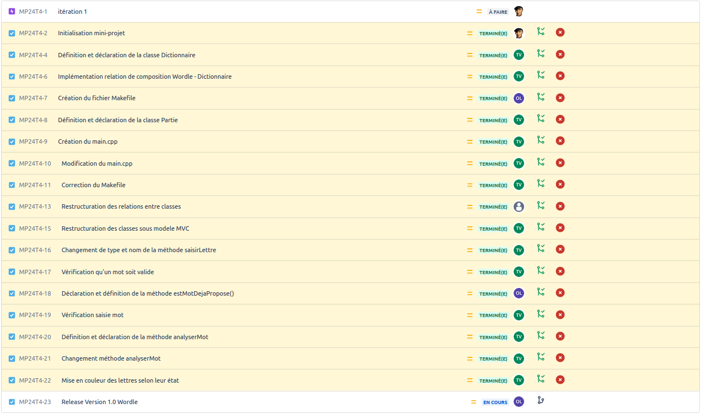

[](https://github.com/btssn-lasalle-84/MP24-T4-WORDLE/actions/workflows/c-cpp.yml)[](https://github.com/btssn-lasalle-84/MP24-T4-WORDLE/actions/workflows/cppformat.yml)


# Mini-Projet WORDLE

## Informations

- Nom du logiciel : Wordle
- Date de début : 29 novembre 2023 12h28
- Numéro de version du logiciel : 1.0
- Date de cette version du logiciel : Décembre 2023

## Présentation + Objectifs

Le but du jeu est de deviner un mot spécifique de cinq lettres en un maximum de six tentatives, en
tapant des lettres sur un écran de six lignes de cinq cases chacune. Chaque lettre devinée à sa bonne
place apparaît en vert, une bonne lettre mal placée en jaune.

La personne qui joue inscrit sur la première ligne un mot de cinq lettres de son choix et entre sa
proposition. Après chaque proposition, les lettres apparaissent en couleurs :
- VERT : la lettre est dans le mot et au bon endroit
- JAUNE : la lettre est dans le mot mais au mauvais endroit
- ROUGE (facultatif) : la lettre n’est dans le mot à aucun endroit

Le mot doit contenir le bon nombre de lettres et être valable, sinon il est refusé.

## Utilisation

Exemple :

```bash
$ make
g++ -c IHMPartie.cpp
g++ -o wordle.out Dictionnaire.o Joueur.o main.o IHMPartie.o Wordle.o

$ ./wordle.out
```

## Ce que le logiciel fait dans cette version

Le logiciel dans la version 1.0 propose au joueur de trouver un mot de 5 lettres en 6 tentatives. Si le mot contient plus de 5 lettres, le mot n'est pas accepté et le joueur doit resaisir un mot de la bonne taille.

Lorsque le joueur a deviné le mot, le jeu affiche "Félicitations ! Vous avez deviné le mot."


## TODO

- Corriger les défauts constatés par le client
- Ajouter les critères de mots valables manquant
- Version 2.0 selon le cahier des charges
- Version 3.0 selon le cahier des charges

## Défauts constatés non corrigés

Ces critères de mots valables ne sont pas respectés dans cette version :

- Les mots qui n’existent pas dans les dictionnaires de référence (Larousse et Robert) de l’année en
cours et les noms propres.
- Les mots composés (chewing-gum, week-end...).
- Les mots qui ne commencent pas par la première lettre indiquée.

Si le joueur ne devine pas le mot au bout de 6 tentatives, il n'y a pas de message retour sur le terminal affichant le mot qui était à deviner (Exemple : "Le mot à deviner était : "  ")

## Itérations



## Diagramme de classes

> Fourni par l'enseignant

## Équipe de développement

- Thomas Vignal thomasvignal.btssn@gmail.com
- Othman Latyaoui othmanlatyaoui.pro@gmail.com

---

©️ BTS SNIR LaSalle Avignon 2024
