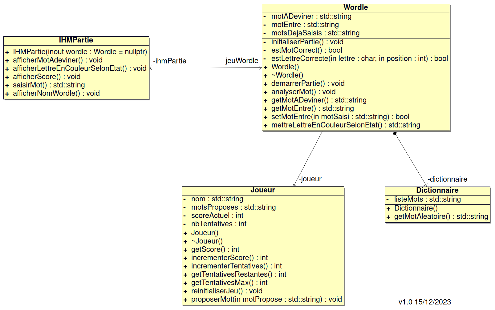

[](https://github.com/btssn-lasalle-84/MP24-T4-WORDLE/actions/workflows/c-cpp.yml)[](https://github.com/btssn-lasalle-84/MP24-T4-WORDLE/actions/workflows/cppformat.yml)

# Mini-Projet WORDLE

## Informations

- Nom du logiciel : Visual Studio Code
- Date de début : 29 avril 2015
- Numéro de version du logiciel : 1.79.2
- Date de cette version du logiciel : Mai 2023

## Présentation

Le but du jeu est de deviner un mot spécifique de cinq lettres en un maximum de six tentatives, en tapant des lettres sur un écran de six lignes de cinq cases chacune. Chaque lettre devinée à sa bonne place apparaît en vert, une bonne lettre mal placée en jaune.

## Utilisation

Exemple :

```bash
$ make
g++ -c   Dictionnaire.cpp
g++ -c   Joueur.cpp
g++ -c   main.cpp
g++ -c   IHMPartie.cpp
g++ -c   Wordle.cpp
g++ -o wordle.out Dictionnaire.o Joueur.o main.o IHMPartie.o Wordle.o

$ ./wordle.out
```

## Ce que le logiciel fait dans cette version


## TODO

## Défauts constatés non corrigés

## Itérations

> Tableaux Markdown et/ou Captures Jira

## Diagramme de classes



## Équipe de développement

- Thomas Vignal <<thomasvignal.btssn@gmail.com>>
- Othman Latyaoui <<othmanlatyaoui.pro@gmail.com>>

---
©️ BTS SNIR LaSalle Avignon 2024
